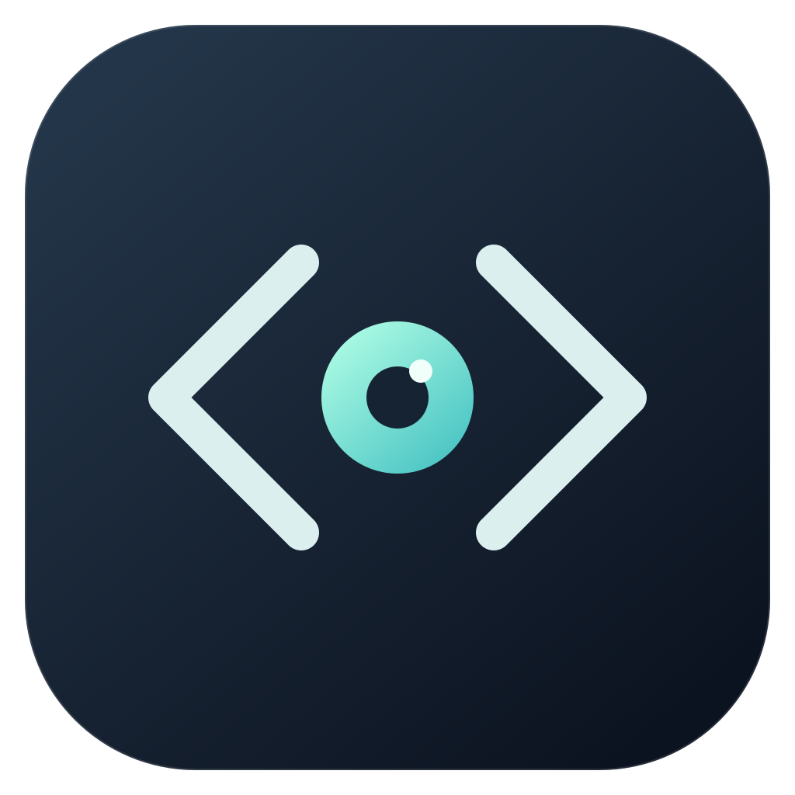

<p align="center">
  
</p>

# Glimpse

A lightweight viewer for code, diffs, and Markdown in the AI era.

**AI writes. You see.**

Glimpse 是使用 Rust + GPUI Kit 构建的只读 macOS 查看器。打开项目目录，在文件和 Git 变更之间切换，专注阅读 AI 生成的代码与文档。

## 当前功能

- **文件夹与目录树**：原生文件夹选择器、按需加载子目录、虚拟列表、键盘导航和可调宽度侧栏。遵循 `.gitignore`，隐藏 `.git`，不递归跟随目录软链接。
- **代码阅读**：只读文本、行号、选择复制、⌘F 搜索和 Tree-sitter 高亮。支持 Rust、JavaScript/TypeScript/TSX、JSON、Python、Go、C/C++、Swift、HTML/CSS、Shell、TOML、YAML、Markdown 和 diff；其他文本按纯文本显示。
- **Git diff**：自动识别仓库、分支和 linked worktree。区分 Staged / Unstaged / Untracked / Conflict，逐文件查看 unified patch，以红绿背景标记增删。支持删除、重命名和二进制差异提示，提供 View file 返回工作区文件。
- **Markdown**：标题、列表、表格、带高亮的代码块、选择复制、预览/源码切换和相对路径图片。
- **刷新**：⌘R 重新读取目录、Git 状态和当前文档。所有文件系统与 Git 操作在后台执行。
- **品牌资源**：原创 SVG、PNG 和 macOS ICNS 图标。

当前是早期可用版本。尚未实现自动文件监听、多标签页、双栏 diff、提交历史比较、Markdown 文档内链接导航、Mermaid/公式、签名和自动更新。刷新会重建目录展开状态及阅读位置。文本文件上限 2 MiB，单次 Git 输出上限 8 MiB；不支持非 UTF-8 文本。Git 视图显示整个仓库的变更，即使打开的是其中的子目录。

## 运行

需要 macOS、Rust 1.99.0 和 Apple Command Line Tools（`xcode-select --install`）。Git 功能需要可用的 `git` 命令。

```sh
cargo run --locked
cargo run --locked -- /path/to/project
cargo run --locked -- README.md
```

| 操作 | 快捷键 |
| --- | --- |
| 打开文件夹 | ⌘⇧O |
| 打开文件 | ⌘O |
| 刷新 | ⌘R |
| 文本内搜索（源码/diff 获得焦点时） | ⌘F |
| 目录树选择 / 展开 / 收起 / 打开 | ↑ ↓ / → / ← / Enter |
| 关闭窗口 / 退出 | ⌘W / ⌘Q |

## 构建与检查

```sh
cargo fmt --all --check
cargo clippy --workspace --all-targets --locked -- -D warnings
cargo test --workspace --locked
cargo build --locked
scripts/bundle-macos.sh debug
open dist/Glimpse.app
```

发布优化构建使用 `scripts/bundle-macos.sh release`。打包脚本需要 Python 3；输出为本地未签名的 `.app`，分发所需的 Developer ID 签名和公证尚未配置。普通构建不需要 Node.js。

GPUI Kit 固定为 `0.7.1`，依赖由 `Cargo.lock` 锁定，使用运行时 Metal shader 编译。首次构建需要下载和编译依赖；开发构建体积不能代表发布版本体积。

## 架构

```text
crates/
  glimpse-core/src/           # 文档、语言映射、目录/Git 模型、diff 字节范围
  glimpse-services/src/       # 文件读取、按层目录扫描、只读 Git 命令
  glimpse-app/src/
    app/                     # 启动、菜单、快捷键、内嵌资源
    views/
      workspace/             # 窗口状态、异步加载、整体布局
      explorer.rs            # 按需目录树
      changes.rs             # Git 变更列表
      reader.rs              # Markdown / 代码 / diff 阅读
      welcome.rs             # 欢迎页
assets/branding/             # SVG 原稿与 PNG
assets/macos/                # ICNS 与 Info.plist
scripts/                     # 本地打包、可选图标生成
```

依赖方向为 `glimpse-app → glimpse-services → glimpse-core`，应用层也可直接引用 core。见 [架构说明](docs/architecture.md) 和 [验证记录](docs/verification.md)。

## License

[MIT](LICENSE). Third-party dependencies retain their respective licenses.
